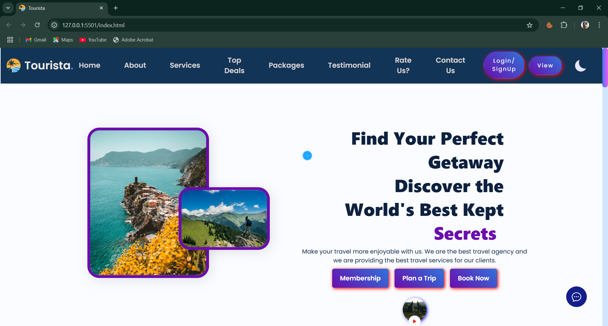
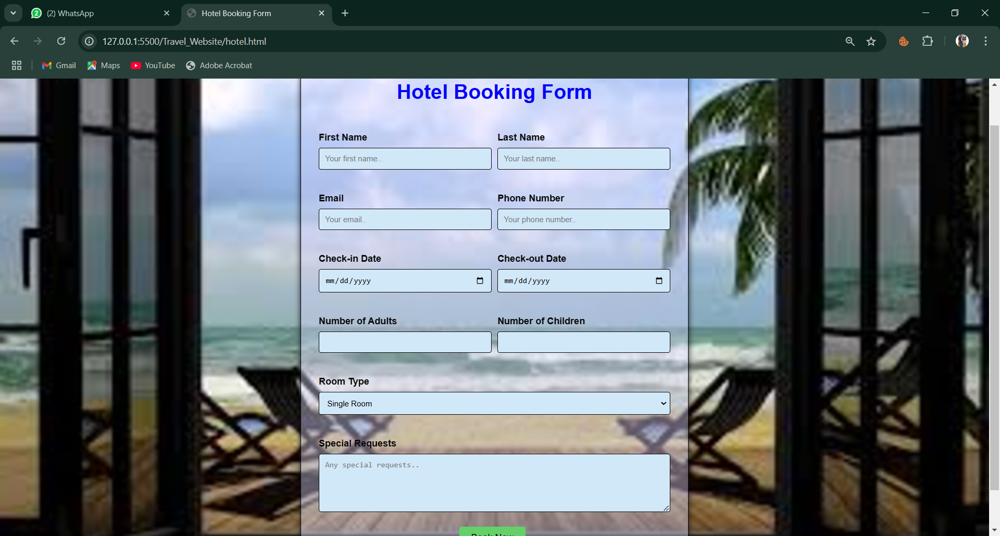
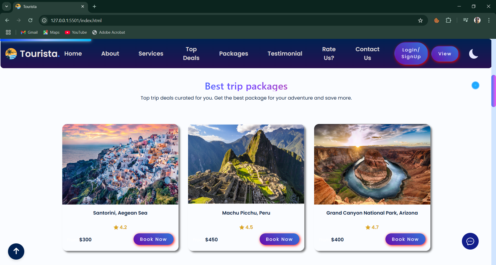
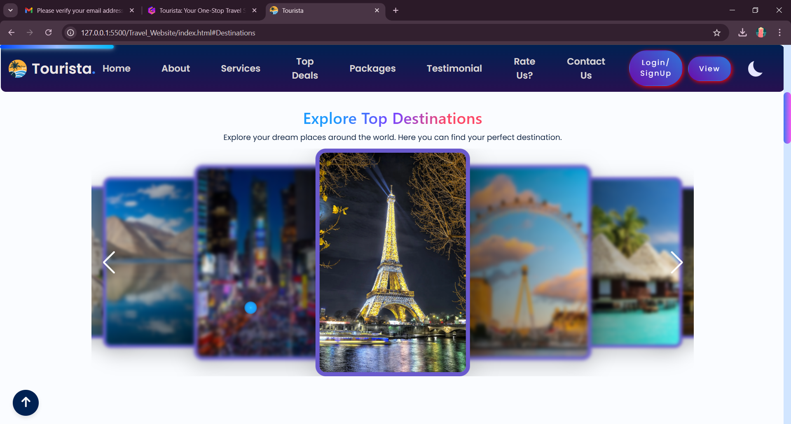
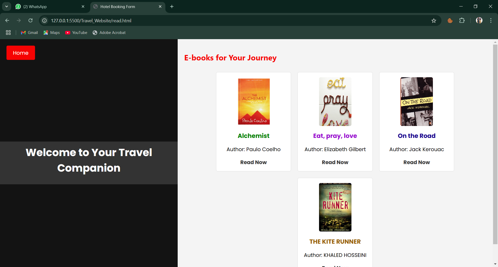
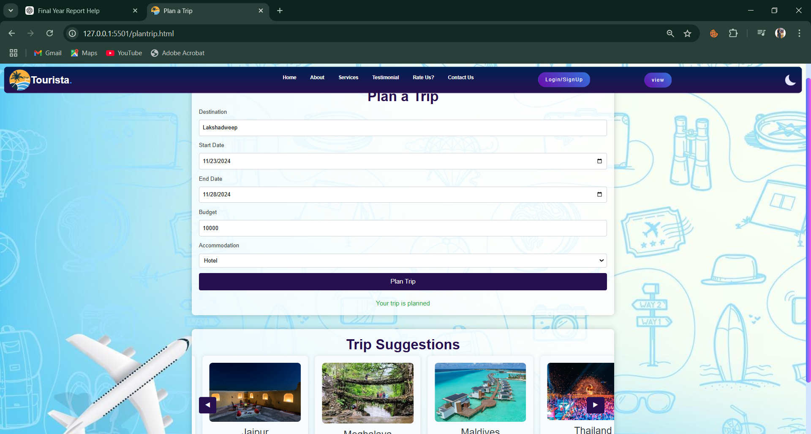
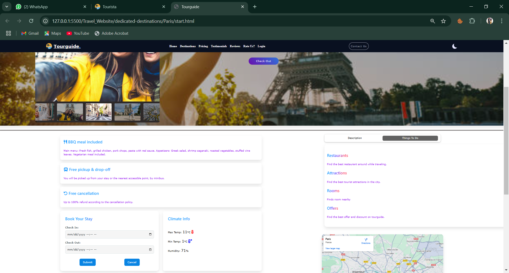

# 🌍 Tourista - MERN Travel Booking Website

Tourista is a full-featured, interactive travel website built using the **MERN stack** (MongoDB, Express, React, Node.js). It allows users to explore and book **tours, hotels and activities**, with integrated **Google Maps**, **Chabot**, and **user dashboards**.

---

## 📸 Screenshots

### 🏠 Home Page


###  Hotel Booking 


###  Packages


###  Destination 


###  E-Books


###  Trip Suggestions 


### 📅 Payments


---

## 🚀 Features

- ✈️ Package and Tour Booking
- 🏞️ Tour & Activity Listings
- 📍 Google Maps Integration
- 🧠 AI Chatbot Support
- ⭐ Reviews & Star Ratings
- 🔒 Secure Authentication (JWT)
- 🧾 User & Admin Dashboards

---

## 🛠 Tech Stack

| Frontend       | Backend        | Database |
|----------------|----------------|----------|
| ReactJS        | Node.js        | MongoDB  |
| Tailwind CSS   | Express.js     | Mongoose |
| Framer Motion  | Stripe API     |          |

---

## ⚙️ Getting Started

### 1. Clone the Repo

```bash
git clone https://github.com/Anugupta5102/Tourista.git
cd Tourista
```

### 2. Setup Backend

```bash
cd backend
npm install
cp .env.example .env
# Fill in your MONGO_URI and STRIPE_SECRET_KEY in .env
npm start
```

### 3. Setup Frontend

```bash
cd ../frontend
npm install
npm start
```

Visit `http://localhost:3000` to access the site.

---

## 🔐 Environment Variables

**Backend `.env`:**
```env
MONGO_URI=your_mongodb_connection
JWT_SECRET=your_jwt_secret
STRIPE_SECRET_KEY=your_stripe_secret_key
```

---

## 📂 Project Structure

```
Tourista/
├── frontend/       # React App
├── backend/        # Express API
└── README.md
```

---

## 👨‍💻 Author

Built with ❤️ by [@Anugupta5102](https://github.com/Anugupta5102)

---

## 📄 License

This project is licensed under the MIT License.
